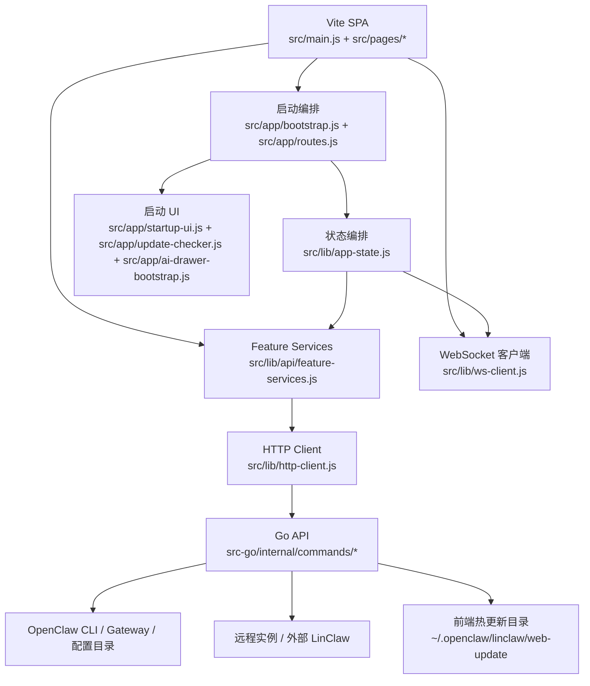

# LinClaw 架构文档

> 当前统一产品名为 `LinClaw`。代码里保留的 `clawpanel*` 文件名、cookie 和目录仅用于兼容旧数据，不再是主路径。

## 1. 文档目标

本文档描述当前项目的真实架构、模块职责、关键数据流、主要技术债，以及桌面版向 `web + Go` 云端版迁移时应遵循的兼容策略。

适用对象：

- 新接手该仓库的开发者
- 准备扩展 Web/headless 模式的维护者
- 计划推进统一命名和发布体系的人

## 2. 项目定位

LinClaw 是 OpenClaw 的可视化管理面板，当前支持以下运行形态：

1. Web 版：Vite 前端 + Go 后端 `src-go/cmd/linclawd` + `src-go/internal/commands/*`
2. 远程实例模式：在本地面板内代理远端 LinClaw / OpenClaw 实例

它本质上不是单纯的“前端页面”，而是一个围绕 OpenClaw 生命周期管理构建的本地控制台：

- 管理 OpenClaw 配置
- 启停 Gateway
- 诊断环境和日志
- 提供内置 AI 助手
- 管理消息渠道、记忆、Agent 和远程实例

## 3. 总体架构

### 3.1 架构特点

- 前端 + Go 后端
- WebSocket 直接连 Gateway，不经过面板后端转发
- 配置、日志、备份、设备密钥等数据统一落在 `~/.openclaw/`
- 项目已经从“本机桌面工具”扩展成“本机 + 远程”混合控制台

### 3.2 当前最重要的架构现实

Go 后端提供统一的 `/__api/*` 接口。

## 4. 代码结构

| 路径 | 角色 | 说明 |
| --- | --- | --- |
| `src/main.js` | 前端薄入口 | 仅初始化主题、登录钩子并调用启动编排 |
| `src/app/*` | 前端控制面 | 启动编排、路由注册、启动 UI、更新检查、AI 抽屉引导 |
| `src/router.js` | 路由层 | 极简 hash 路由，按页面动态加载模块 |
| `src/pages/*` | 页面层 | 仪表盘、模型、服务、助手、聊天、日志等页面 |
| `src/components/*` | 组件层 | 侧边栏、模态框、Toast、AI 抽屉等 |
| `src/lib/api/*` | 前端业务服务层 | 按领域封装命令调用，如 `config/service/agents/messaging` |
| `src/lib/http-client.js` | 前端传输层 | `/__api/*` 调用、缓存、请求日志、后端健康检查、登录拦截 |
| `src/lib/*` | 前端基础设施 | WebSocket、应用状态、主题、消息缓存、策略逻辑 |
| `scripts/release.sh` | 发布打包脚本 | 构建前端并跨平台编译 `linclawd`，输出可分发发布包 |
| `scripts/run-vite.js` | 开发启动包装 | 为 Vite 注入 Go API 目标，统一前端开发入口 |
| `src-go/cmd/linclawd` | Go 服务入口 | 启动 HTTP API、静态资源服务、Gateway `/ws` 反向代理 |
| `src-go/internal/commands/*` | Go 命令层 | 配置、服务、消息、记忆、技能、更新、配对、助手工具等 |
| `src-go/internal/application/*` | Go 应用服务层 | 收口配置等跨命令复用的业务流程，负责持久化与审计协作 |
| `src-go/internal/domain/*` | Go 领域规则层 | 承载 `openclaw.json` 等纯规则、迁移与归一化逻辑 |
| `src-go/internal/httpapi/*` | Go 传输层 | 处理 `/__api/*`、认证、cookie、静态资源与 WebSocket 代理 |
| `tests/*.js` | Node 单测 | 当前仅覆盖 Gateway 守护策略 |

## 5. 运行形态

### 5.1 Web 版（Go 后端）

- `src-go/cmd/linclawd` 提供统一的 `/__api/*` 契约
- 直接复用前端现有的 `fetch('/__api/...')` 与 `/ws` 连接模型
- 适合 Linux 服务器、Docker、无 GUI 环境

### 5.2 远程实例

- 面板维护远程实例清单
- 当前活跃实例决定多数接口是本地执行还是代理到远端

## 6. 核心模块职责

### 6.1 前端启动与状态编排

主入口已拆成“薄入口 + 启动编排”两层：

- `src/main.js`
  1. 初始化主题
  2. 安装全局登录钩子
  3. 调用 `startLinclawApp`
- `src/app/bootstrap.js`
  1. 检查后端健康和鉴权
  2. 注册页面路由并挂载 shell
  3. 探测 OpenClaw 安装状态
  4. 启动 Gateway 轮询和恢复提示
  5. 在 Gateway 可用时自动连接 WebSocket
  6. 延迟初始化 AI 抽屉和更新检查

辅助模块职责：

- `src/app/startup-ui.js`：启动期登录弹层、后端离线页、默认密码提示、splash 隐藏
- `src/app/routes.js`：集中注册页面路由
- `src/app/update-checker.js`：全局前端更新检查
- `src/app/ai-drawer-bootstrap.js`：AI 抽屉懒加载和页面上下文注入

`src/lib/app-state.js` 是当前前端的“轻量状态内核”，负责：

- OpenClaw 是否就绪
- Gateway 是否运行
- 自动重启计数和守护状态
- 当前活跃实例
- Web 模式下的自动重启策略

这层没有引入状态管理库，优点是简单直接，缺点是状态来源分散，跨页面行为主要靠监听器和模块级变量协作。

### 6.2 HTTP 传输层与 Feature Services

前端不再通过单个“大而全”的 API facade 访问后端，而是拆成两层：

1. `src/lib/http-client.js`
   - 统一调用 `/__api/*`
   - 提供读请求缓存和失效能力
   - 记录请求日志，供诊断页展示
   - 负责后端健康检查和 `401` 登录拦截

2. `src/lib/api/feature-services.js`
   - 按领域分组暴露 API，如 `config`、`service`、`agents`、`messaging`
   - 页面可按需引入 `featureServices` 或扁平的 `api`
   - 写操作在这里就近声明缓存失效策略

这次拆分的价值在于：

- 传输细节与业务语义分离
- 启动编排不再依赖旧命名的 `tauri-api`
- 页面层可以逐步按业务域拆分，而不是继续堆在单一适配层上

### 6.3 WebSocket 与 Gateway

`src/lib/ws-client.js` 直接连接 Gateway：

1. 与 `/ws?token=...` 建立连接
2. 等待 `connect.challenge`
3. 通过后端生成带 Ed25519 签名的 connect frame
4. 握手成功后使用 snapshot/sessionKey
5. 维持 ping、重连、自动配对和 origin 修复

这条链路是聊天、实时状态和部分交互体验的基础。

### 6.4 Go 后端命令层

`src-go/internal/commands/*` 提供所有业务命令：

- `config.go`：配置相关命令入口；底层配置归一化已开始下沉到 `application/configservice` 与 `domain/openclawconfig`
- `service.go`：Gateway 启停、状态检测
- `assistant.go`：助手工具、文件/进程/端口/图片存储
- `messaging.go`：消息渠道插件与配置
- `pairing.go` / `device.go`：设备密钥与配对
- `update.go`：前端热更新
- `skills.go`：skills CLI 适配

这一层的目标应是“薄命令壳”：

- `commands` 只做参数解析、错误映射和命令注册
- `application` 负责配置持久化、审计、流程编排
- `domain` 负责纯配置规则，例如旧字段迁移、默认值补全、主模型规范化

## 7. 关键数据与文件布局

当前项目与 OpenClaw 的共享状态主要位于 `~/.openclaw/`：

| 路径 | 作用 |
| --- | --- |
| `~/.openclaw/openclaw.json` | OpenClaw 主配置 |
| `~/.openclaw/mcp.json` | MCP 配置 |
| `~/.openclaw/linclaw.json` | 面板自身主配置（兼容读取 `clawpanel.json`） |
| `~/.openclaw/linclaw/` | 面板私有主数据目录，如图片、会话、热更新（兼容旧 `clawpanel/`） |
| `~/.openclaw/logs/` | 日志目录 |
| `~/.openclaw/backups/` | 备份目录 |
| `~/.openclaw/agents/` | Agent 运行数据和模型注册表 |
| `~/.openclaw/instances.json` | 远程实例清单 |
| `~/.openclaw/linclaw-device-key.json` | 设备主密钥（兼容旧 `clawpanel-device-key.json`） |

兼容层当前仍会回退读取旧的 `clawpanel*` 命名，但所有新写入都应以 `linclaw*` 为主。

## 8. 关键业务流程

### 8.1 启动与鉴权

- 前端请求 `/__api/auth_check`
- `/__api/auth_login` 写入 `linclaw_session` cookie
- 之后所有非豁免命令必须通过认证中间件

### 8.2 OpenClaw 配置读写

Go 后端负责配置读写，包括 UTF-8 BOM 处理、JSON 损坏回退等。

### 8.3 Gateway 管理

- 状态检测
- 启动、停止、重启
- 前端 `gateway-guardian-policy.js` 提供自动重启策略

### 8.4 AI 助手

助手本质是带工具的聊天系统：

- 页面逻辑在 `src/pages/assistant.js`
- 工具能力由 Go 后端暴露
- 支持执行命令、读写文件、系统信息、端口检查、网页抓取、图片持久化
- 数据主目录落在 `~/.openclaw/linclaw/`

### 8.5 远程实例代理

项目已经支持多实例控制：

- 非 `ALWAYS_LOCAL` 命令在活跃实例非本机时会被代理到远端
- 面板 UI 通过实例切换器切换上下文

这块能力很强，但目前还缺更严谨的认证和能力边界设计。

### 8.6 前端热更新

桌面版支持下载前端 ZIP 到本地目录并覆盖内嵌前端资源优先级：

1. 检查远端 manifest
2. 下载 ZIP
3. 校验 hash
4. 解压到 `~/.openclaw/linclaw/web-update`
5. 下次页面加载优先读取该目录

这是一个很实用的架构能力，但也是安全敏感区。

## 9. 当前架构优点

- Web 部署轻量，能上 Linux 服务器和 Docker
- 模块边界基本清楚，功能域划分较自然
- WebSocket 直连 Gateway，避免面板成为聊天数据转发瓶颈

## 10. 当前主要风险与技术债

### 10.1 测试覆盖

测试覆盖有待提升，需补充更多接口与业务流程测试。

### 10.2 命名深度耦合

LinClaw 的历史命名已经进入：

- 包名和产物名
- Tauri `productName` / `identifier`
- Rust crate 名
- Cookie / storage key
- 配置文件名和私有数据目录
- systemd 服务名、部署脚本、仓库链接

这意味着更名必须设计兼容层，而不是批量替换字符串。

### 10.3 安全敏感区较多

包括但不限于：

- 助手工具具备本机读写和命令执行能力
- Web/headless 模式默认暴露 HTTP 服务
- 前端热更新会从远端下载并落盘资源
- 远程实例代理会把控制面扩展到网络边界之外

### 10.4 测试覆盖不足

当前测试只覆盖两个小模块：

- `tests/gateway-guardian-policy.test.js`

缺失的关键测试类型：

- API 契约测试
- Rust/Node 语义一致性测试
- 配置迁移测试
- WebSocket 握手测试
- 多实例/远程代理测试
- 热更新安全测试

## 11. LinClaw 兼容迁移策略

### 11.1 总原则

不要做一次性全局替换。建议分四阶段推进。

### 11.2 阶段划分

#### 阶段 A：品牌层先改，存储层不动

目标：

- README、文档、页面标题、About 页、站点文案统一成 `linclaw`
- 代码中引入集中式品牌常量，停止继续散落硬编码字符串

可以立即改的内容：

- 页面显示文案
- README / 文档 / 官网链接文案
- 新增常量，如 `src/lib/brand.js`

暂时不要动的内容：

- `clawpanel.json`
- `~/.openclaw/clawpanel/`
- `clawpanel_session`
- Tauri bundle identifier

#### 阶段 B：引入兼容读取

目标：

- 新代码开始支持 `linclaw` 名称
- 旧用户数据无感迁移

推荐策略：

1. 读配置时先找 `linclaw.json`，找不到再回退 `clawpanel.json`
2. 私有目录先找 `~/.openclaw/linclaw/`，找不到再回退 `clawpanel/`
3. localStorage/sessionStorage/cookie 同时接受旧 key 和新 key
4. Rust 与 Node 两侧同时实现兼容读取逻辑

#### 阶段 C：迁移产物和发布标识

目标：

- 包名、仓库名、应用名统一

涉及项：

- `package.json.name`
- `src-tauri/Cargo.toml`
- `src-tauri/tauri.conf.json` 的 `productName` 和 `identifier`
- 安装包文件名
- GitHub Releases / repo URL / 官网链接

注意：

- `identifier` 修改会影响桌面应用升级链路和系统识别
- 这一步要和安装包测试、升级测试一起做

#### 阶段 D：清理旧名

前提：

- 至少经历一个兼容发布周期
- 迁移脚本和回退方案稳定

届时可以：

- 停止写入旧 key
- 删除旧文案和别名读取
- 收口部署脚本和目录名

### 11.3 推荐的最小实施顺序

建议按下面顺序推进，而不是并行硬改：

1. 统一品牌常量
2. 统一 Rust/Node 路径解析函数
3. 做兼容读取和迁移测试
4. 再改产物名和 bundle identifier
5. 最后清理遗留 `clawpanel*`

## 12. 推荐的近期技术改造

### 12.1 第一优先级

- 为 Rust 和 Node 后端建立统一命令契约测试
- 把配置路径、品牌名、Cookie 名、数据目录集中到共享常量层
- 为远程实例设计独立认证模型
- 为热更新补充路径校验和安全测试

### 12.2 第二优先级

- 补 Web/headless 模式与桌面模式的行为对齐
- 将巨型页面拆分出更明确的 service/controller 层
- 为 Docker/实例代理设计更清晰的领域边界

### 12.3 第三优先级

- 引入 CI 中的 build/test/check 基线
- 为 README 中的运维文档补齐真实文件
- 建立更清晰的版本同步和发布脚本

## 13. 当前 review 结论摘要

从架构角度看，这个项目已经具备“完整产品雏形”，不是 demo。它最大的价值在于：

- 前端体验完整
- 本机控制能力强
- 已经具备远程和集群管理雏形

它最大的风险也很明确：

- 双后端分叉
- 命名耦合过深
- 高权限能力较多但测试不足

因此，最合理的路线不是机械全仓替换历史名字，而是先完成“统一语义”和“兼容层设计”，再做品牌与发布层迁移。
